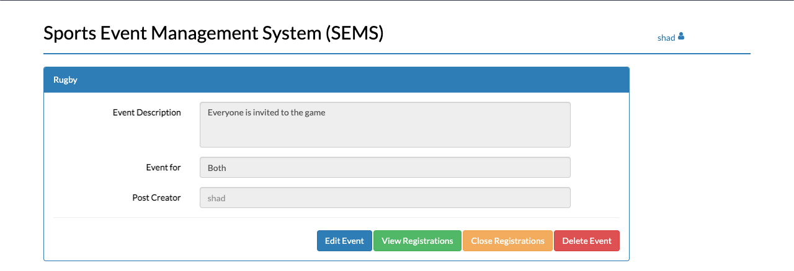

# Sports Event Management System
**This system is used by Sports Teachers and Administrators to announce various Sports and Cultural events. Students can then register (if applicable) to these events online without any offline form-filling formalities. Main features of this application include:**

**Administrators:-**
1. Can post and edit Sports events.
2. Can Enable/Disable registrations for any event.
3. Can view registrations for any event.
4. Can delete any event.
5. Can post winners for any event.

**Students:-**
1. Can view Sports events.
2. Can register for any event if Administrators have enabled it or if applicable for Student's gender.
3. Can view registrations for any event.
4. Can view winners of any event posted by Administrators.

## Demo
> User currently login both member role and manager role.

1. ___Login page___
    

2. ___Register page___
    

3. ___Menu AddEvent & Signout___
    

4. ___Event page___
    

5. ___Add Sports-Event___
    

6. ___Edit & Delete-Event___
    

7. ___View Event-Registration___
    

8. ___Recent Event-Winners___
    

